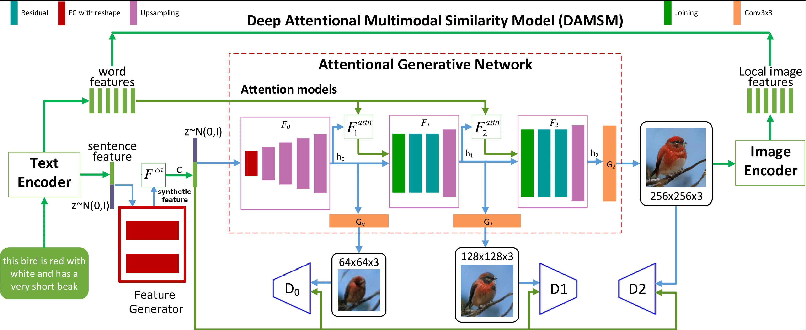
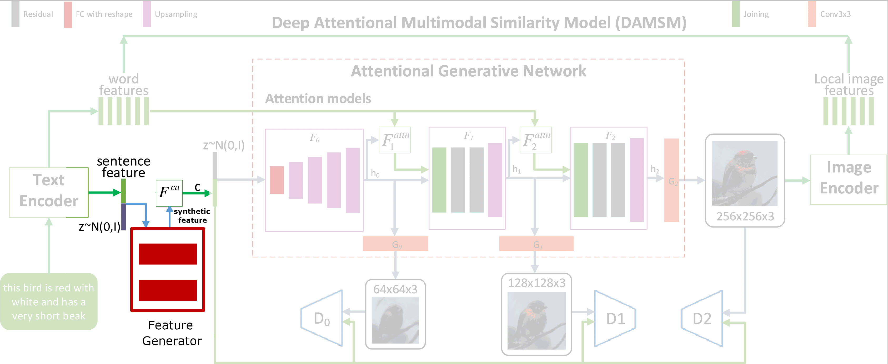
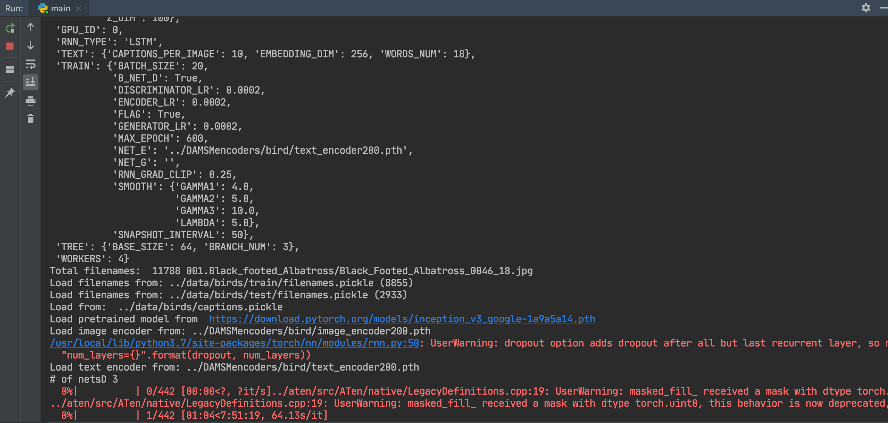

# Test exercise 

Python 3 fork of [AttnGAN](http://openaccess.thecvf.com/content_cvpr_2018/papers/Xu_AttnGAN_Fine-Grained_Text_CVPR_2018_paper.pdf) implementation 
was taken from [link](https://github.com/davidstap/AttnGAN) 

Original architecture

# Hypothesis

Text representations play important role in AttnGAN, using them model 
creates first, raw image representation.

Since text representations of images usually noisy, it may be useful to 
somehow make them more meaningful.

This is exactly what authors do in [paper](https://arxiv.org/pdf/1712.01381.pdf) — 
create useful features from noisy texts using GAN.

One can use their encoding module in several ways:
- Concat/average/etc synthetic features with LSTM sentence representations generating 
them from TF-IDF (as proposed in the paper) on different stages of image generation process ([StackGAN](https://arxiv.org/abs/1612.03242))
- Use LSTM sentence representations instead of TF-IDF features in encoding module. This way, 
one should retrain noisy-encoding module using such representations. 

So the images are now generated given input words and noise-reducing encoding of the input sentence presented in the second paper

# Proposed architecture

# More precisely

   

Synthetic features are used in F_0 model

I've chosen second variant for implementation because of simplicity, and it may give 
noticeable improvements when we use noisy texts, since noisy sentence embeddings would 
be replaced with more accurate features.  

My implementation works, you can launch it using 

`python3 main.py --cfg cfg/bird_attn2.yml --gpu -1`

  
